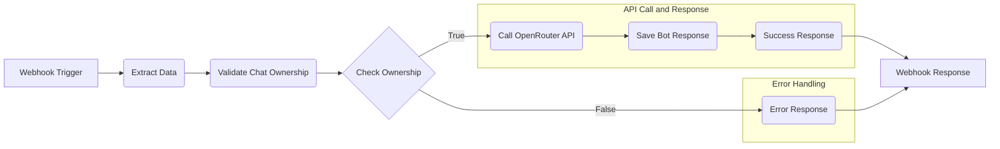

# Subspace Chatbot

A modern AI-powered chatbot application built with React, TypeScript, NHost (Hasura), n8n and real-time capabilities.

[](https://simpnick6703-subspace-chatbot.netlify.app/)

## Features

- Email authentication with OAuth support (Discord)
- Real-time messaging with GraphQL subscriptions
- AI-powered responses via n8n workflow automation
- Markdown rendering with syntax highlighting
- Copy-to-clipboard functionality for code blocks
- Dark/Light theme support
- Row-level security for chat isolation
- Responsive design with Tailwind CSS

## Tech Stack

- **Frontend**: React 18, TypeScript, Vite
- **Authentication**: Nhost Auth
- **Database**: PostgreSQL via Hasura GraphQL
- **AI Integration**: n8n + OpenRouter API
- **Styling**: Tailwind CSS with custom themes
- **Deployment**: Netlify

## Prerequisites

- Docker
- Nhost account and project
- OpenRouter API key

## Setup

1. Clone the repository:
   ```bash
   git clone https://github.com/SimpNick6703/Subspace-Chatbot.git
   cd Subspace-Chatbot
   ```
2. Copy `.env.example` to `.env` and configure your Nhost credentials
3. Start Docker Engine
4. Install dependencies and build:
   - Using Docker:
   ```powershell
   .\build.ps1
   ```
   - Using npm native command:
   ```bash
   npm install
   npm run build
   ```
## Development

Start the development server:
- Using Docker command:
  ```powershell
  .\start.ps1
  ```
- Using native commands:
  ```bash
  npm run dev
  ```

The application will be available at `http://localhost:3000`

## Environment Variables

See `.env.example` for required environment variables:
- `VITE_NHOST_BACKEND_URL`: Your Nhost GraphQL endpoint
- `VITE_NHOST_PROJECT_ID`: Your Nhost project ID
- `VITE_NHOST_REGION`: Your Nhost region

## Database Schema

The application uses two main tables managed by Hasura:

### chats table

| Column | Type | Constraints | Description |
|--------|------|-------------|-------------|
| id | uuid | PRIMARY KEY, DEFAULT gen_random_uuid() | Unique chat identifier |
| user_id | uuid | NOT NULL, REFERENCES auth.users(id) | Owner of the chat |
| created_at | timestamp with time zone | NOT NULL, DEFAULT now() | Chat creation timestamp |
| updated_at | timestamp with time zone | NOT NULL, DEFAULT now() | Last update timestamp |

**Permissions:**
- **Insert**: Users can only create chats for themselves
- **Select**: Users can only view their own chats
- **Update**: Users can only update their own chats
- **Delete**: Users can only delete their own chats

### messages table

| Column | Type | Constraints | Description |
|--------|------|-------------|-------------|
| id | uuid | PRIMARY KEY, DEFAULT gen_random_uuid() | Unique message identifier |
| chat_id | uuid | NOT NULL, REFERENCES public.chats(id) | Associated chat |
| user_id | uuid | NOT NULL, REFERENCES auth.users(id) | Message sender |
| content | text | NOT NULL | Message content |
| is_bot | boolean | NOT NULL, DEFAULT false | Whether message is from bot |
| created_at | timestamp with time zone | NOT NULL, DEFAULT now() | Message creation timestamp |
| updated_at | timestamp with time zone | NOT NULL, DEFAULT now() | Last update timestamp |

**Permissions:**
- **Insert**: Users can only create messages in their own chats
- **Select**: Users can only view messages from their own chats
- **Update**: Users can only update messages in their own chats
- **Delete**: Users can only delete messages from their own chats

## n8n Workflow Architecture

The AI integration is powered by a n8n workflow that processes user messages and generates AI responses:



### Workflow Nodes Configuration

#### 1. Webhook Trigger
- **Type**: Webhook node
- **Method**: POST
- **Response**: Using 'Respond to Webhook' Node

#### 2. Extract Data
- **Type**: Set node
- **Values**:
  - `chat_id`: `{{ $json.body.input.chat_id }}`
  - `message`: `{{ $json.body.input.message }}`
  - `user_id`: `{{ $json.body.session_variables['x-hasura-user-id'] }}`

#### 3. Validate Chat Ownership
- **Type**: HTTP Request node
- **Method**: POST
- **URL**: `https://nhost-project-id.hasura.nhost-region-id.nhost.run/v1/graphql`
- **Headers**:
  - `x-hasura-admin-secret`: `nhost-hasura-admin-secret`
  - `Content-Type`: `application/json`
- **Body**:
  ```json
  {
    "query": "query GetChatById($chat_id: uuid!) { chats_by_pk(id: $chat_id) { id user_id } }",
    "variables": {
      "chat_id": "{{ $('Extract Data').item.json.chat_id }}"
    }
  }
  ```

#### 4. Check Ownership
- **Type**: If node
- **Condition**: `{{ $json.data.chats_by_pk.user_id }}` is equal to `{{ $('Extract Data').item.json.user_id }}`

#### 5. Call OpenRouter API
- **Type**: HTTP Request node (if Check Ownership is true)
- **Method**: POST
- **URL**: `https://openrouter.ai/api/v1/chat/completions`
- **Headers**:
  - `Content-Type`: `application/json`
  - `Authorization`: `Bearer openrouter-api-key`
- **Body**:
  ```json
  {
    "model": "microsoft/phi-3-mini-128k-instruct",
    "messages": [
      {
        "role": "user",
        "content": "{{ $('Extract Data').item.json.message }}"
      }
    ],
    "temperature": 0.7,
    "max_tokens": 1024
  }
  ```

#### 6. Save Bot Response
- **Type**: HTTP Request node
- **Method**: POST
- **URL**: `https://nhost-project-id.hasura.nhost-region-id.nhost.run/v1/graphql`
- **Headers**:
  - `Content-Type`: `application/json`
  - `x-hasura-admin-secret`: `nhost-hasura-admin-secret`
- **Body**:
  ```json
  {
    "query": "mutation sendMessage($chat_id: uuid!, $content: String!, $is_bot: Boolean!, $user_id: uuid!) { insert_messages_one(object: { chat_id: $chat_id, content: $content, is_bot: $is_bot, user_id: $user_id }) { id } }",
    "variables": {
      "chat_id": "{{ $('Extract Data').item.json.chat_id }}",
      "content": {{ JSON.stringify($('Call OpenRouter API').item.json.choices[0].message.content) }},
      "is_bot": true,
      "user_id": "{{ $('Extract Data').item.json.user_id }}"
    }
  }
  ```

#### 7. Success Response
- **Type**: Set node
- **Values**:
  - `success`: `{{ true }}` (Boolean)
  - `message`: `{{ $('Call OpenRouter API').item.json.choices[0].message.content }}` (String)

#### 8. Webhook Response
- **Type**: Respond to Webhook node
- **Response**: JSON
- **Body**: `{{ $json }}`

#### 9. Error Response
- **Type**: Set node (if Check Ownership is false)
- **Values**:
  - `success`: `{{ false }}` (Boolean)
  - `error`: `"Unauthorized: You don't have permission to access this chat"` (String)

## Architecture

- **Authentication**: Nhost handles user management and OAuth
- **Database**: Hasura provides GraphQL API with real-time subscriptions
- **AI Pipeline**: Hasura actions trigger n8n workflows that call OpenRouter API
- **Security**: Row-level security ensures users only access their own chats

## Deployment

The application frontend is configured for Netlify deployment with the included [netlify.toml](https://github.com/SimpNick6703/Subspace-Chatbot/blob/29ea4a338d5ac6194f65741f6aa6b1dd72f4d9cc/chatbot-app/netlify.toml).

> [!NOTE]
> I've shut down my self hosted n8n workflow so sent messages' will not be sent to AI provider and thus, no response will be shown. 

For backend n8n self host, pick your method:
  - [npm](https://docs.n8n.io/hosting/installation/npm/)
  - [docker](https://docs.n8n.io/hosting/installation/docker/)
    - Configure a cloud VM and install docker. [[How-to](https://docs.docker.com/engine/install/)]
    - Open your desired port to network from network manager of your service host.
    - run command
      ```bash
      docker run -it --rm --name n8n -p {your_port}:5678 -e N8N_ENFORCE_SETTINGS_FILE_PERMISSIONS=true -e N8N_RUNNERS_ENABLED=true -v n8n_data:/home/node/.n8n docker.n8n.io/n8nio/n8n
      ```
    - open access your n8n dashboard at `http://{your.cloud.vm.ip}/{your_port}`
    - Update your webhook URL in `sendMessage` Hasura Actions

## Reference Files

- `hasura_metadata.json`: Complete Hasura metadata with table definitions and permissions
- `n8n_openapi.yml`: n8n OpenAPI specifications
- [Monokai Dimmed](https://github.com/microsoft/vscode/blob/main/extensions/theme-monokai-dimmed/themes/dimmed-monokai-color-theme.json), [Solarized Light](https://github.com/microsoft/vscode/blob/main/extensions/theme-solarized-light/themes/solarized-light-color-theme.json) for themes
